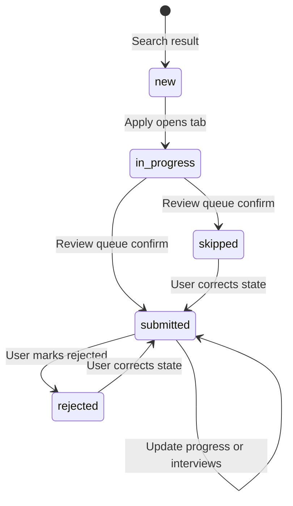
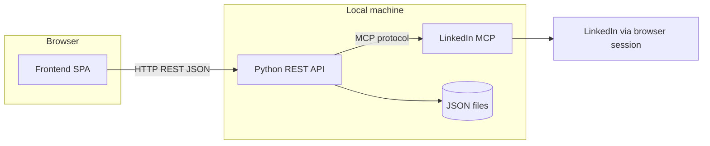

# Requirements: ReverseRecruiter

**Status:** DRAFT
**Last updated:** 2026-05-22
**Owner:** User (personal local tool)
**Confidence:** ~88% — scope and flows strong; Apply mechanism and several UX/data rules need product decisions before LOCKED

---

## 1. Summary

ReverseRecruiter is a **personal, local-only** web application that helps one user find LinkedIn jobs matching their profile, review results in a table, open jobs to apply manually on LinkedIn, and **track the full application pipeline** (submitted, skipped, rejected, interview timeline, notes) in JSON files on disk.

A **Python backend** is the **only** component that talks to the **LinkedIn MCP**; the **frontend** talks only to the backend via **REST JSON on localhost**. **docker-compose** (or an equivalent single script) starts both processes for v1.

**Not in v1:** multi-user/cloud hosting, automated Easy Apply submit, scheduled/automatic searches, email/push alerts, PDF/Excel export.

---

## 2. Problem & goals

### Problem statement

Manual LinkedIn job hunting is slow, and it is difficult to track where each application stands (applied, interviewing, rejected) across many companies and roles.

### Success metrics

| Metric | Target | How measured |
|--------|--------|--------------|
| Time saved | Less time finding relevant jobs vs manual LinkedIn browsing | Subjective comparison per search session |
| Pipeline clarity | All active applications have status, stage, and interview notes in one place | Zero “lost” in-progress jobs after restart |

### Non-goals (out of scope for v1)

- Multi-user accounts or cloud/SaaS deployment
- Automated Easy Apply submission inside the app
- Scheduled or background job searches without user action
- Email or push notifications for new jobs
- Export of results to PDF or Excel
- Official LinkedIn Partner API integration (use dedicated MCP instead)

---

## 3. Users & context

| Persona / actor | Need | Notes |
|-----------------|------|-------|
| Job seeker (single user) | Search, rank, apply on LinkedIn, track pipeline | Personal machine only |

### Constraints

- LinkedIn access via **dedicated LinkedIn MCP service** (browser/session-based)
- **Manual apply** on LinkedIn: MCP/backend opens job URLs in browser tabs; user completes application on LinkedIn
- **Full frontend/backend separation**; backend **must be Python**
- Data stored locally as **JSON files**
- LinkedIn Terms of Service / automation risk accepted for personal local use

---

## 4. Functional requirements

### 4.1 Core flows

| ID | Flow | Description |
|----|------|-------------|
| F-1 | Search & discover | User runs search with MCP filters; backend returns ~25 jobs, rules-based match score from LinkedIn profile, sorted table |
| F-2 | Apply (manual) | User selects jobs → Apply → MCP opens one tab per job; jobs marked **In progress**; popup-blocked → batches of 5 |
| F-3 | Review queue | User confirms In progress jobs as **Submitted** or **Skipped**; **submitted_at** set on Submitted confirm |
| F-4 | Pipeline tracking | Search + Pipeline screens; progress stages, interview timeline, rejected filter, split details panel |

#### F-1 Search & discover

1. User starts LinkedIn session via MCP once per session; reuse until session expires.
2. User runs search from **Search** screen with **all MCP filters**: keywords, location, date posted, job type, experience, work type, Easy Apply only, sort.
3. Backend loads **~25 jobs** (1 page / `max_pages=1`), fetches job details via MCP, pulls user profile via `get_my_profile`, computes **rules-based match score** (v1 default), **sorts by score** (no hide-by-threshold).
4. **Saved searches** store filters plus matching profile reference.
5. Re-running a saved search: jobs already known locally appear **dimmed with status badge**.

**Results table columns (v1):**

| Column | Required | Notes |
|--------|----------|-------|
| Company | Yes | |
| Position | Yes | Link to job description; click opens details panel |
| Published | Yes | Display exactly as LinkedIn shows (no conversion) |
| Applicant count | Nice-to-have | Blank if unavailable |
| Match score | Yes | Rules-based from profile vs job |
| Location | Yes | |
| Work type | Yes | Remote / hybrid / on-site |
| Salary | Yes | Show `—` when missing |
| Job URL | Yes | |

#### F-2 Apply (manual on LinkedIn)

1. User selects one or more rows → **Apply**.
2. Backend/MCP opens **one browser tab per job**.
3. If browser blocks popups: open in **batches of 5** with user prompt between batches.
4. Each opened job → status **In progress** in local JSON store.

#### F-3 Review queue → Submitted / Skipped

1. **Review queue** lists all **In progress** jobs.
2. User bulk-confirms **Submitted** or **Skipped**.
3. **Submitted** records **`submitted_at`** (applied-at timestamp) at confirm time.
4. User may transition to **Submitted**, **Skipped**, or **Rejected** from **any** prior state (including recovery from mistaken skip).

#### F-4 Pipeline tracking

**Navigation:**

- **Search** — active job hunt and results table
- **Pipeline** — sub-filters: In progress, Submitted, Skipped, Rejected

**Lifecycle states:**

| State | Meaning |
|-------|---------|
| `in_progress` | User clicked Apply; LinkedIn tab opened |
| `submitted` | User confirmed application was sent |
| `skipped` | User chose not to pursue |
| `rejected` | Application closed as rejected; shown as **badge/filter under Submitted area** (no separate top-level Rejected tab) |

**Progress stage** (one current stage per job):

Applied → Screening → Interview → Offer → Hired, plus **Withdrawn**.

**Interviews (per job):**

- Unlimited timeline of interview events
- Each event: datetime, with whom, interview type, notes
- User can add, edit, and delete events

**Details panel:**

- Trigger: click **position name** (not company name alone)
- Shows: job/company info, current progress stage, interview timeline, notes
- Layout: **recommended** table top ~60%, details bottom ~40% (final layout at design time)
- Empty state: “Select a position to view application details.”
- Storage remains **per job** (`job_id`); panel may show read-only hint if multiple jobs exist at same company

**LinkedIn already-applied:**

- If `get_job_details` exposes an already-applied indicator → show badge on row
- Otherwise → rely on local status only (spike during design)

### 4.2 States & rules

| Rule | Behavior |
|------|----------|
| Match scoring | Rules-based default; sort all results by score |
| Re-search | Known jobs dimmed + badge |
| Rejected UI | Filter/badge within Submitted area |
| Timestamps | `submitted_at` only when user confirms Submitted (not on Apply click) |

### 4.3 Permissions & authorization

| Actor | Action | Allowed? | On deny |
|-------|--------|----------|---------|
| Local user | All app features | Yes | N/A — single user, localhost v1 |

v1: No authentication between frontend and backend (localhost only).

### 4.4 Data

| Data | Source | Retention | PII? |
|------|--------|-----------|------|
| Job search results | LinkedIn MCP | Snapshot per search in JSON | Low |
| User LinkedIn profile | MCP `get_my_profile` | Cached for matching / saved searches | Yes |
| Application pipeline | User input | JSON files, indefinite local | Yes |
| Interview notes | User input | Per job in JSON | Possibly |
| Saved searches | User input | JSON | No |

**Persistence:** JSON file(s) in a project data directory (exact paths/names in design).

---

## 5. Architecture boundary (requirements-level)

| Rule | Requirement |
|------|-------------|
| MCP access | Backend only — frontend never calls MCP |
| API style | REST JSON over HTTP on localhost |
| Backend language | Python |
| Frontend stack | No preference — recommend at design (default candidate: React + Vite) |
| Run model | docker-compose or one script starts frontend + Python API |
| Apply mechanism | MCP opens LinkedIn job pages; user applies manually |

---

## 6. Non-functional requirements

### 6.1 Scalability

| Dimension | Now | 12-month expectation | Implication |
|-----------|-----|----------------------|-------------|
| Users | 1 | 1 | No multi-tenant |
| Jobs per search | ~25 | ~25 | Single MCP page |
| Data volume | Small JSON files | Moderate history | File-based OK |

### 6.2 Resilience

| Dependency | Failure mode | Required behavior |
|------------|--------------|-------------------|
| LinkedIn MCP | Down / error | Clear API error in UI; no silent failure |
| LinkedIn session | Expired | Prompt user to re-authenticate via MCP |
| MCP search | Partial results | Show results with warning |
| Browser popups | Blocked | Fallback: open tabs in batches of 5 |

**Idempotency:** Re-running same saved search is safe; merges with local job status.

**Degraded mode:** If MCP unavailable, Search disabled; Pipeline/history still readable from JSON.

### 6.3 Consistency

| Operation | Consistency need | User-visible guarantee | Conflict handling |
|-----------|------------------|------------------------|-------------------|
| Local JSON writes | Strong | Saved data visible after restart | Last-write-wins |
| LinkedIn search | Eventual | Results reflect time of search | New search replaces result set for that run |

### 6.4 Other NFRs

- **Security:** Bind to localhost; no remote access v1; MCP session is trust boundary
- **Observability:** Backend logs MCP calls and errors (detail at design)
- **Accessibility / i18n:** Not required v1

---

## 7. Scenarios & acceptance criteria

### 7.1 Happy path

| ID | Trigger | Steps | Expected result | Acceptance |
|----|---------|-------|-----------------|------------|
| S-1 | Run search | Profile via MCP, 25 jobs, rank | Table with all columns | Renders within 60s or shows progress/error |
| S-2 | Apply 12 jobs | Select → Apply | 12 tabs or batched by 5 | All 12 marked `in_progress` |
| S-3 | Review queue | Confirm 3 submitted | `submitted_at` set | Visible under Pipeline → Submitted |
| S-5 | Interview timeline | Add 2 events on one job | Timeline in details panel | Persists after restart |
| S-6 | Details panel | Click position name | Bottom panel shows stage + interviews | Updates when row changes |

### 7.2 Failure & edge cases

| ID | Trigger | Expected result | Acceptance |
|----|---------|-----------------|------------|
| S-4 | Mark submitted as rejected | Rejected badge/filter | Visible under Submitted with Rejected filter |
| S-7 | MCP session expired | Search fails gracefully | User prompted to re-login |
| S-8 | App restart | Reload JSON | Saved searches and all job states unchanged |
| S-9 | Popup blocker | Apply many jobs | Batch of 5 with user continue prompt |

### 7.3 Abuse / misuse

Not applicable for v1 (single-user localhost).

---

## 8. Decisions log

| Date | Decision | Rationale | Decided by |
|------|----------|-----------|------------|
| 2026-05-22 | Personal local tool only | Single user scope | User |
| 2026-05-22 | LinkedIn via dedicated MCP | User requirement | User |
| 2026-05-22 | Manual apply via opened tabs | No apply tool in MCP; extend MCP to open pages | User |
| 2026-05-22 | Python backend + REST JSON FE | Full separation | User |
| 2026-05-22 | Backend-only MCP access | Clear security boundary | User |
| 2026-05-22 | docker-compose local run | One command startup | User |
| 2026-05-22 | JSON file persistence | User preference over SQLite | User |
| 2026-05-22 | Rules-based match from profile | Default when LLM not chosen | User (defer) |
| 2026-05-22 | ~25 jobs per search | Speed vs coverage | User |
| 2026-05-22 | Search + Pipeline navigation | Pipeline sub-filters for statuses | User |
| 2026-05-22 | Rejected under Submitted filter | Not separate top tab | User |
| 2026-05-22 | Interview timeline per job | Full pipeline tracking | User |
| 2026-05-22 | `submitted_at` on confirm Submitted | Applied-at semantics | User |
| 2026-05-22 | Details on position click | User preference | User |
| 2026-05-22 | Bottom split panel recommended | Desktop-local UX | Agent recommend; user deferred layout |

---

## 9. Assumptions

| ID | Assumption | Risk if wrong | Validate by |
|----|------------|---------------|-------------|
| A-1 | MCP can open job URLs in user browser | Apply flow blocked | MCP spike |
| A-2 | `get_my_profile` sufficient for rules matching | Poor match quality | Spike + sample profiles |
| A-3 | Salary and applicant count sometimes absent | Empty/`—` cells | `get_job_details` spike |
| A-4 | Personal local use acceptable for MCP automation | Account restriction | User accepts risk |

---

## 10. Open issues

| ID | Issue | Severity | Owner | Target |
|----|-------|----------|-------|--------|
| O-1 | Does `get_job_details` expose “already applied”? | Low | Design | MCP spike |
| O-2 | Exact rules for match score | Low | Design | Design doc |
| O-3 | Frontend framework | Low | Design | Recommend React + Vite |
| O-4 | **Apply tab opening:** current LinkedIn MCP has no `open_job_url(s)` tool; F-2 requires MCP/backend to open tabs | **Blocker** | User | Before LOCKED |
| O-5 | Job-level free-text **notes** (separate from per-interview notes)? | Medium | User | Before LOCKED |
| O-6 | Saved searches: CRUD scope (save/rename/delete/list) and where in nav | Medium | User | Before LOCKED |
| O-7 | Re-run saved search: refresh profile for scoring vs freeze snapshot at save time | Medium | User | Before LOCKED |
| O-8 | “Known job” dimming: any `job_id` ever seen vs only jobs with pipeline status | Medium | User | Before LOCKED |
| O-9 | Progress stage rules when lifecycle is `skipped` / `rejected`; `Withdrawn` vs `skipped` | Medium | User | Before LOCKED |
| O-10 | Review queue entry point (dedicated nav vs Pipeline → In progress only) | Low | User | Design |
| O-11 | LLM-based match scoring in v1 or rules-only | Medium | User | Before LOCKED |
| O-12 | Re-Apply on jobs already `in_progress` / `submitted` | Low | User | Before LOCKED |
| O-13 | LinkedIn MCP process: bundled in docker-compose vs user-managed external service | Medium | User | Before LOCKED |

*Target: zero blockers before LOCKED.*

---

## 11. Confidence breakdown

| Factor | Score (0–100) | Notes |
|--------|---------------|-------|
| Scope & goals | 95 | |
| Functional behavior | 82 | Apply mechanism (O-4), notes (O-5), progress rules (O-9) open |
| NFRs | 88 | Lightweight for personal tool |
| Scenarios | 88 | Missing acceptance for saved-search CRUD, re-Apply, profile refresh |
| Open issues | 70 | 1 blocker (O-4); several medium items need user |
| **Weighted total** | **~88%** | Blocker must resolve for ≥95% |

### Ambiguity review (2026-05-22)

MCP inventory checked: `search_jobs`, `get_job_details`, `get_my_profile`, `close_session` exist; **no** tool to open job URLs in the user browser (contrasts with F-2 and decision “extend MCP to open pages”). Session start is implicit (no `start_session` tool); first MCP call likely launches browser — UX for “start session” still unspecified.

---

## 12. Lock checklist

- [ ] Stakeholder reviewed success metrics
- [ ] No blocker open issues (or explicit accept-with-risk)
- [ ] NFRs: scalability, resilience, consistency addressed
- [ ] Critical scenarios have acceptance criteria
- [ ] User confirmed: **requirements LOCKED**

---

## Appendix

### MCP search parameters (reference)

Supported by LinkedIn MCP `search_jobs`: keywords (required), location, date_posted, job_type, experience_level, work_type, easy_apply, sort_by, max_pages (v1 uses 1 page).

### Glossary

- **MCP:** Model Context Protocol service providing LinkedIn browser automation
- **Pipeline:** Application tracking after initial search (In progress → Submitted / Skipped / Rejected)
- **Review queue:** UI to confirm In progress jobs as Submitted or Skipped
