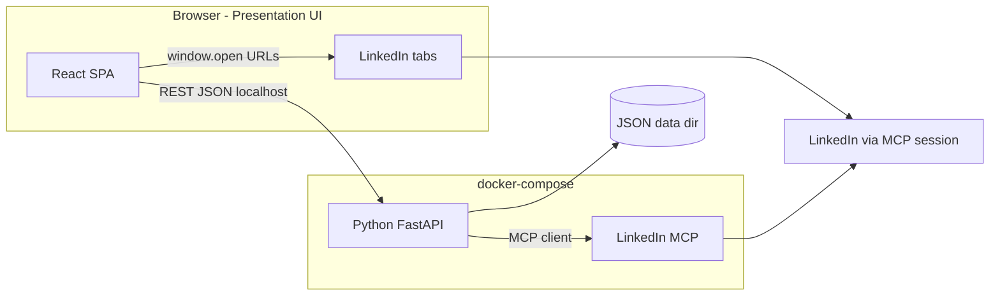
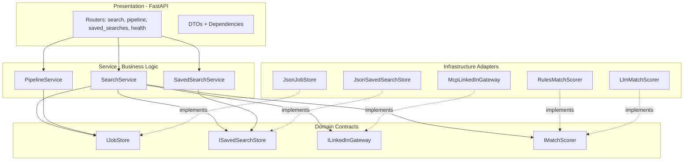
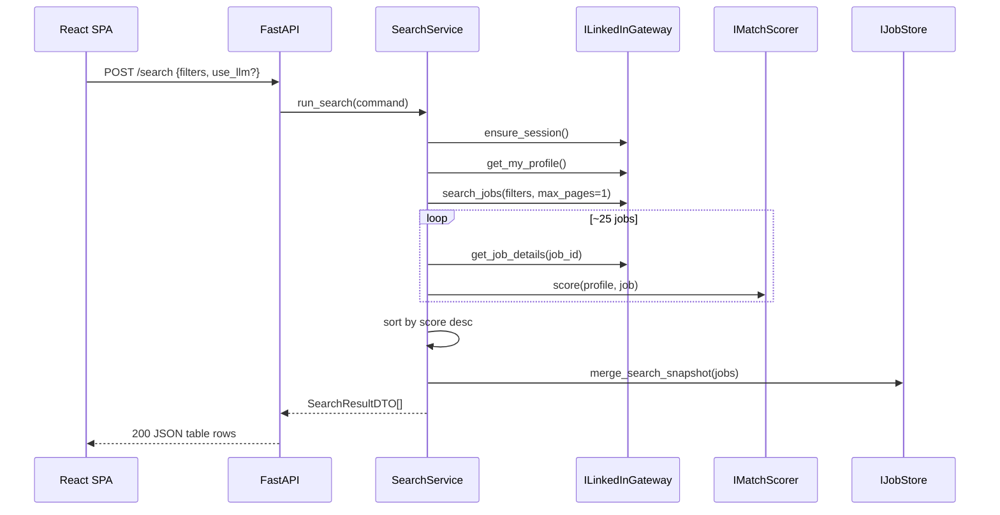
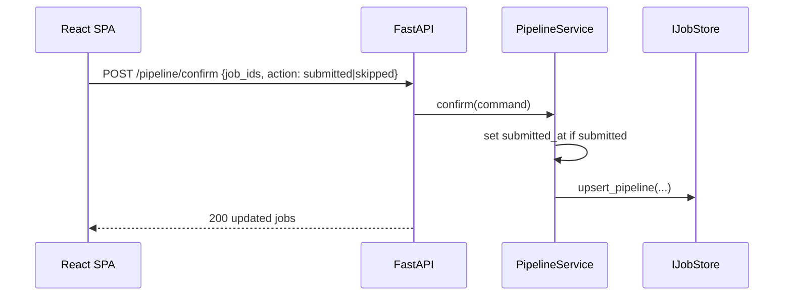
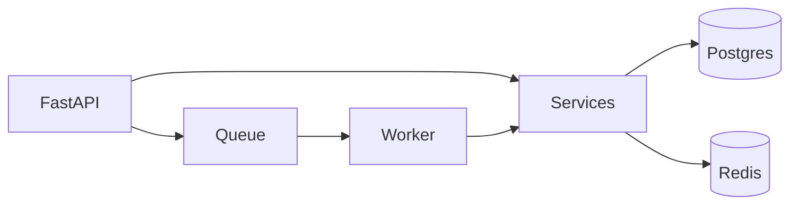
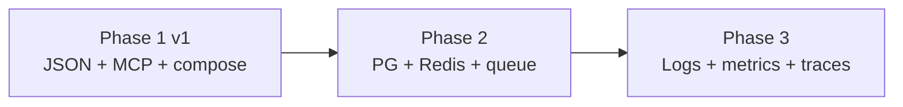

# System Architecture Plan — ReverseRecruiter

> Generated under **Senior System Architect** (Staff/Principal). Principles: S.O.L.I.D, 3-Tier Architecture, Layer Agnosticism.
>
> **Source:** `docs/original_requirements.md` (LOCKED 2026-05-22). This plan translates requirements into implementable boundaries without scope creep beyond v1.

## 1. Context

| Item | Value |
|------|-------|
| **Problem** | Manual LinkedIn job hunting is slow; application pipeline state (applied, interviewing, rejected) is scattered across many roles and companies. |
| **Users / callers** | Single job seeker on a personal machine; browser SPA + localhost Python API. |
| **Constraints** | Backend **must be Python**; **only backend** calls LinkedIn MCP; FE opens job URLs in tabs; **JSON on disk** for persistence; **docker-compose** runs FE + API + MCP; ~25 jobs/search; localhost bind; no auth v1. |
| **Non-goals (v1)** | Multi-user/cloud, automated Easy Apply, scheduled searches, email/push alerts, PDF/Excel export, official LinkedIn Partner API. |

### Requirements review summary

| Area | Assessment | Architecture implication |
|------|------------|---------------------------|
| Boundaries (§5) | Clear and correct | FE ↔ REST JSON; BE ↔ MCP; BE ↔ JSON; FE ↔ `window.open` for Apply |
| Core flows F-1–F-4 | Complete with acceptance scenarios | Four service use-case groups; stable repository contracts |
| State machine (§4.2) | Well-defined; recovery paths included | `PipelineService` owns transitions; idempotent re-search merge |
| Data (§4.4) | JSON preferred over SQLite | Phase 1 **JSON file adapters** behind interfaces (not ad-hoc writes in routers) |
| NFR resilience | MCP/session/popup failures specified | Gateway errors surfaced as API problem+json; degraded mode when MCP down |
| Open issues O-1–O-12 | Low; deferred | Resolved recommendations in §6; spikes called out |

**Deferred items (design-time, non-blocking):**

- **O-1** Already-applied badge: optional field from `get_job_details`; UI shows badge when present, else local status only.
- **O-2** Match rules detail: implement `RulesMatchScorer` with explicit, testable criteria (see §5.2).
- **O-3** Frontend: **React + Vite + TypeScript** (requirements allow recommendation).
- **O-10** Review queue entry: **Pipeline → In progress** as primary; optional header badge count linking there (no separate top-level nav in v1).
- **O-12** Re-Apply: allow re-Apply on `new` search rows only; dimmed pipeline rows use **Open URL** action without resetting lifecycle unless user explicitly moves state.

---

## 2. System topology



| Rule (from requirements) | Plan enforcement |
|--------------------------|------------------|
| MCP access backend-only | `ILinkedInGateway` in infrastructure; no MCP SDK in FE |
| Apply via FE tabs | `POST /apply` returns URLs; FE batch-opens (5 per batch on block) |
| JSON persistence | All pipeline/saved-search writes via repository adapters |

---

## 3. Three-Tier Model (Python backend)

### 3.1 Layer responsibilities

| Layer | Technology | Owns | Must not |
|-------|------------|------|----------|
| **Presentation** | FastAPI routers, Pydantic DTOs, DI, HTTP status mapping | Validation, routing, CORS for localhost, error envelopes | Match rules, MCP protocol, JSON file paths, lifecycle business rules |
| **Service** | Use cases / domain services | Search orchestration, scoring orchestration, pipeline transitions, saved-search rules, merge logic for re-search dimming | `fastapi`, `httpx` to MCP, raw file I/O |
| **Data** | Repository + gateway **interfaces** (Protocols); adapters in `infrastructure/` | JSON read/write, MCP HTTP/SSE client, optional LLM client | HTTP route definitions, UI concerns |

**Frontend** is a separate **UI presentation** tier (React). It does not duplicate business rules: lifecycle transitions and `submitted_at` semantics are enforced only in the service layer.

### 3.2 Suggested repository layout

```text
backend/
  api/                    # Presentation: routers, dependencies, request/response models
  services/               # SearchService, PipelineService, SavedSearchService
  domain/
    entities.py           # Job, PipelineJob, SavedSearch, InterviewEvent, ProfileSnapshot
    enums.py              # LifecycleState, ProgressStage, InterviewType
    repositories.py       # Protocols: IJobStore, ISavedSearchStore, ...
    gateways.py           # ILinkedInGateway, IMatchScorer
  infrastructure/
    json/                 # JsonJobStore, JsonSavedSearchStore
    linkedin_mcp/         # McpLinkedInGateway
    scoring/              # RulesMatchScorer, LlmMatchScorer (optional)
  main.py                 # FastAPI app factory, lifespan, compose health
frontend/                 # React + Vite SPA (separate package in repo)
data/                     # Mounted volume: *.json (gitignored)
docker-compose.yml
```

### 3.3 Repository interfaces (Data contract)

```python
# domain/repositories.py — illustrative; adapt names during implementation

from typing import Protocol
from domain.entities import Job, PipelineJob, SavedSearch, ProfileSnapshot

class IJobStore(Protocol):
    async def get_by_job_id(self, job_id: str) -> PipelineJob | None: ...
    async def list_by_lifecycle(self, state: str | None) -> list[PipelineJob]: ...
    async def upsert_pipeline(self, job: PipelineJob) -> None: ...
    async def merge_search_snapshot(self, jobs: list[Job], search_run_id: str) -> list[Job]: ...

class ISavedSearchStore(Protocol):
    async def list(self) -> list[SavedSearch]: ...
    async def save(self, saved: SavedSearch) -> SavedSearch: ...
    async def get(self, saved_search_id: str) -> SavedSearch | None: ...

class ILinkedInGateway(Protocol):
    async def ensure_session(self) -> None: ...  # implicit or explicit re-auth signal
    async def get_my_profile(self) -> ProfileSnapshot: ...
    async def search_jobs(self, filters: dict) -> list[str]: ...  # job ids
    async def get_job_details(self, job_id: str) -> Job: ...

class IMatchScorer(Protocol):
    async def score(self, profile: ProfileSnapshot, job: Job) -> float: ...
```

| Interface | Aggregate / concern | Key methods |
|-----------|---------------------|-------------|
| `IJobStore` | Pipeline + search merge | `upsert_pipeline`, `merge_search_snapshot`, `list_by_lifecycle` |
| `ISavedSearchStore` | Saved filter sets + frozen profile | `save`, `list`, `get` |
| `ILinkedInGateway` | LinkedIn via MCP | `search_jobs`, `get_job_details`, `get_my_profile`, `ensure_session` |
| `IMatchScorer` | Match score | `score` (rules default; LLM when configured) |

**S.O.L.I.D mapping:**

| Principle | Decision |
|-----------|----------|
| **S** | `SearchService` vs `PipelineService` vs `SavedSearchService` — separate reasons to change |
| **O** | New `LlmMatchScorer` or new JSON layout version via new adapter, not service edits |
| **L** | `InMemoryJobStore` substitutable for `JsonJobStore` in unit tests |
| **I** | Narrow stores per aggregate; no god-repository |
| **D** | Services depend on `IJobStore`, `ILinkedInGateway`, `IMatchScorer` via FastAPI `Depends()` |

### 3.4 Layer dependency diagram



### 3.5 Request / data flow (happy paths)

#### F-1 Search & discover



#### F-2 Apply (manual tabs — FE responsibility)

```mermaid
sequenceDiagram
  participant FE as React SPA
  participant API as FastAPI
  participant PS as PipelineService
  participant JS as IJobStore

  FE->>API: POST /apply {job_ids[]}
  API->>PS: mark_in_progress(job_ids)
  PS->>JS: upsert_pipeline(in_progress)
  PS-->>API: {urls: [...]}
  API-->>FE: 200 + job URLs
  Note over FE: window.open each URL; batches of 5 if blocked
```

#### F-3 Review queue confirm



---

## 4. Domain model (service-owned)

### 4.1 Lifecycle vs progress stage

| Concept | Field | Values | Notes |
|---------|-------|--------|-------|
| **Lifecycle** | `lifecycle_status` | `null` (search-only), `in_progress`, `submitted`, `skipped`, `rejected` | Drives dimming on re-search (only non-null) |
| **Progress stage** | `progress_stage` | `applied`, `screening`, `interview`, `offer`, `hired`, `withdrawn` | Editable anytime; **withdrawn ≠ skipped** |
| **Timestamps** | `submitted_at` | ISO datetime | Set only on confirm **Submitted**, not on Apply |

State transitions match requirements §4.2; `PipelineService` validates allowed transitions and supports correction paths (e.g. `skipped` → `submitted`).

### 4.2 Saved search

| Field | Purpose |
|-------|---------|
| `filters` | MCP search parameter snapshot |
| `profile_snapshot` | Frozen at save time; used for scoring on re-run (no `get_my_profile` for score) |
| `id`, `created_at` | List/run on Search screen |

v1: save, list, run only — no rename/delete API.

### 4.3 JSON persistence (Phase 1 adapter design)

Requirements mandate JSON files; use **atomic writes** (write temp + rename) and a single `data/` mount in compose.

| File (proposed) | Contents |
|-----------------|----------|
| `data/pipeline_jobs.json` | Map `job_id` → `PipelineJob` (+ embedded interview events) |
| `data/saved_searches.json` | Array of `SavedSearch` |
| `data/settings.json` | `use_llm_scoring`, last session hint (optional) |

**Conflict policy:** last-write-wins (requirements §6.3). Service layer serializes writes per aggregate to avoid torn reads.

### 4.4 Match scoring (resolves O-2)

| Mode | Implementation | Default |
|------|----------------|---------|
| Rules | `RulesMatchScorer` — weighted signals: title/keyword overlap, location match, experience level, work type, Easy Apply flag vs profile preferences | **Yes** |
| LLM | `LlmMatchScorer` — optional; gated by UI toggle → API flag; timeout + fallback to rules on failure | No |

Sort all results by score descending; **no hide-by-threshold** (requirements).

---

## 5. API surface (Presentation)

Base URL: `http://localhost:<api_port>/api/v1` (exact port in compose). CORS: localhost FE origin only.

| Method | Path | Service operation | Notes |
|--------|------|-------------------|-------|
| GET | `/health` | — | Liveness |
| GET | `/ready` | gateway ping optional | MCP optional for readiness = API up |
| POST | `/session/ensure` | `ILinkedInGateway.ensure_session` | Surfaces session expired (S-7) |
| POST | `/search` | `SearchService.run_search` | Body: MCP filters + `use_llm`; returns ~25 ranked rows |
| GET | `/search/saved` | `SavedSearchService.list` | |
| POST | `/search/saved` | `SavedSearchService.save` | Captures frozen profile |
| POST | `/search/saved/{id}/run` | `SearchService.run_saved` | Uses frozen profile for scoring |
| POST | `/apply` | `PipelineService.mark_in_progress` | Returns `{ jobs: [{ job_id, url }] }` |
| GET | `/pipeline` | `PipelineService.list` | Query: `lifecycle`, `include_rejected` under submitted |
| POST | `/pipeline/confirm` | `PipelineService.confirm` | `submitted` \| `skipped` |
| PATCH | `/pipeline/{job_id}` | `PipelineService.update` | lifecycle, progress_stage, rejected |
| GET | `/pipeline/{job_id}` | `PipelineService.get_details` | Details panel payload |
| POST | `/pipeline/{job_id}/interviews` | `PipelineService.add_interview` | |
| PATCH | `/pipeline/{job_id}/interviews/{event_id}` | `PipelineService.update_interview` | |
| DELETE | `/pipeline/{job_id}/interviews/{event_id}` | `PipelineService.delete_interview` | |

**Error contract:** 4xx/5xx with `{ "error": code, "message": "...", "detail": ... }`; MCP down → 503 on search routes; pipeline routes remain 200 when reading JSON (degraded mode §6.2).

---

## 6. Frontend architecture (UI presentation)

| Screen | Routes (suggested) | Backend deps |
|--------|-------------------|--------------|
| Search | `/` | `/search`, saved search endpoints |
| Pipeline | `/pipeline?filter=in_progress\|submitted\|skipped` | `/pipeline`; rejected as filter under submitted |
| Review queue | `/pipeline?filter=in_progress` (primary) | bulk confirm endpoint |

**Table columns (F-1):** company, position (opens details), published (raw LinkedIn string), applicant count, match score, location, work type, salary (`—` if missing), job URL.

**Apply UX:** select rows → Apply → open tabs; popup blocked → batches of 5 with continue prompt (S-9).

**Details panel:** position click → bottom ~40% panel; empty state copy per requirements.

**Tech:** React 18 + Vite + TypeScript; TanStack Query for API cache; minimal component library (e.g. shadcn or MUI — pick one at implementation).

---

## 7. Path to Production

ReverseRecruiter v1 **is** Phase 1 for product purposes; Phases 2–3 describe evolution if scope grows beyond personal local use.

### Phase 1: MVP (JSON + compose) — **v1 target**

| Component | Choice | Notes |
|-----------|--------|-------|
| API | FastAPI + uvicorn | Localhost bind `0.0.0.0` in container, published to host only |
| Service | `services/*` | Frozen interfaces before any store swap |
| Stores | `JsonJobStore`, `JsonSavedSearchStore` | Behind `IJobStore` / `ISavedSearchStore` |
| LinkedIn | `McpLinkedInGateway` | docker-compose service link |
| Scoring | `RulesMatchScorer` + optional `LlmMatchScorer` | Env var for LLM API key |
| FE | React + Vite | Static served via compose or vite dev proxy |
| Infra | docker-compose | FE + API + MCP; volume mount `./data` |

**Exit criteria:** Scenarios S-1–S-11, S-3–S-9 acceptance met; restart preserves JSON (S-8); MCP failure degrades gracefully (S-7).

### Phase 2: Scalability (only if requirements change)

| Component | Choice | Notes |
|-----------|--------|-------|
| Primary store | Postgres | Migrate JSON via one-shot script; **same** service interfaces |
| Cache | Redis | MCP session metadata, LLM rate limits |
| Async | Redis streams or RQ | Background LLM scoring for large result sets |
| Repository swap | `PostgresJobStore` adapter | **No** service rewrites |



**Exit criteria:** Not required for personal v1; document for hypothetical multi-machine or heavier search volume.

### Phase 3: Observability

| Signal | Implementation |
|--------|----------------|
| Logging | Structured JSON; `request_id` middleware; log MCP call latency/errors |
| Metrics | Prometheus: search duration, MCP error rate, JSON write failures |
| Health | `/health`, `/ready` (MCP optional on ready) |
| Tracing | OpenTelemetry optional across API → MCP client |

**Exit criteria:** Operable SLOs for search latency (target: S-1 within 60s or explicit progress/error).

### Phase evolution



---

## 8. docker-compose (v1)

| Service | Image / build | Ports | Volumes |
|---------|---------------|-------|---------|
| `frontend` | `frontend/Dockerfile` | `5173:5173` or nginx `8080` | — |
| `api` | `backend/Dockerfile` | `8000:8000` | `./data:/app/data` |
| `linkedin-mcp` | Upstream MCP image (pin version) | internal | MCP session/cookies volume TBD at spike |

API env: `MCP_BASE_URL`, `DATA_DIR`, `LLM_API_KEY` (optional), `LOG_LEVEL`.

---

## 9. Risks and open questions

| Risk | Mitigation |
|------|------------|
| LinkedIn ToS / account restriction (A-4) | User-accepted; localhost-only; no scheduled automation |
| MCP session expiry | `ensure_session` + clear UI re-auth; search disabled, pipeline readable |
| Popup blockers | FE batching of 5 (required behavior) |
| JSON corruption on crash | Atomic writes; optional startup backup copy |
| LLM cost/latency | Optional toggle; fallback to rules; async in Phase 2 if needed |
| `get_job_details` missing fields (A-3) | Display `—` / blank; spike confirms applicant count + salary |
| Already-applied indicator (O-1) | Optional badge; spike during MCP integration |

---

## 10. Implementation order

1. **Domain** — entities, enums, lifecycle rules, repository/gateway Protocols.
2. **Infrastructure** — `JsonJobStore`, `JsonSavedSearchStore`, `McpLinkedInGateway` (spike MCP tools first).
3. **Services** — `PipelineService` (state machine + interviews), `SearchService`, `SavedSearchService`, `RulesMatchScorer`.
4. **API** — routers, DTOs, DI wiring, error mapping, health endpoints.
5. **Compose** — API + MCP + data volume; verify S-7/S-8.
6. **Frontend** — Search table, Apply batching, Pipeline filters, details panel, review confirm.
7. **Optional** — `LlmMatchScorer`, already-applied badge after O-1 spike.
8. **Phase 3** — structured logging and `/metrics` when operational needs appear.

---

## 11. Checklist (architect self-review)

- [x] Persona, role, and principles reflected
- [x] Presentation = FastAPI/REST only; Service has zero MCP/JSON imports
- [x] Data = repository interfaces + swappable JSON (and future Postgres) adapters
- [x] Phase 1 / 2 / 3 documented with concrete tech choices
- [x] Mermaid data flow and layer diagrams included
- [x] S.O.L.I.D and layer agnosticism cited where they drove decisions
- [x] No unrequested production code in this deliverable
